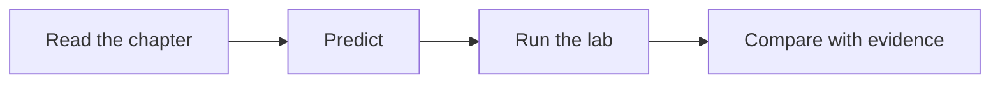

# Before you board

**You will be able to:** decide whether you are ready, and set up the two repositories.

## Assumed knowledge

- Run commands in a terminal; use `cd`, `ls`, `cat`.
- A browser sends HTTP requests to a server.
- Nothing else. Containers, YAML, DNS, storage and signals are taught when needed.

## Two repositories

| Repo | Contains | Use it to |
|---|---|---|
| `apollo11-docs` | This site | Learn the concepts and follow the labs |
| `Apollo11` | App source, Dockerfiles, manifests, scripts | Run every lab |

## Setup for the hands-on route

```bash
git clone https://github.com/darshan-raul/Apollo11.git
cd Apollo11
git checkout 69113dcc80f77e32301d8ee7b9e73a67c923de96
git rev-parse HEAD     # must print the hash above
```

- Run every lab from the `Apollo11` repo root.
- Tool list, versions and preflight: [Prepare your launchpad](../labs/setup).

## Learning loop used throughout


```mermaid
flowchart LR
  R[Read the chapter] --> P[Predict] --> D[Run the lab] --> C[Compare with evidence]
```

- **Predict** before every command that changes something.
- **Compare** your prediction with the output. A mismatch is the lesson.

Next: [How this course works](./how-to-use-this-course).
